   # **TITANIC-CASE-STUDY**

  ## TABLE OF CONTENT

#### 1 INTRODUCTION 
#### 1.2 Objective of the Analysis
#### 1.3 Data Cleaning

#### 2	 EXPLORATORY DATA ANALYSIS 
#### 2.1 Total passengers onboard the ship 
#### 2.2 Passengers by Class
#### 2.3 Passengers by Sex
#### 2.4 Passengers by Age Group
#### 2.5 Passengers by Siblings
#### 2.6 Passenger by Children
#### 2.7 Fare Prices 
#### 2.8 Passengers by Embarkment
#### 2.9 Passengers by Sex and Class
#### Figure 1. Overview Dashboard

#### 3 TAILORED DATA ANALYSIS
#### 3.1 No. of Dead and Survived Passengers
#### 3.2 Dead Passengers by Sex 
#### 3.2.1 Survived Passengers by Sex
#### 3.3 Survive Passengers by Class
#### 3.4 Survived Passengers by Age Group
#### 3.5 Survived Passengers by Embarked Location
#### 3.6 Survived Male to Female Ratio by Class 
#### 3.7 Survived Male to Female Ratio by Age Group
#### Figure 2 Survived Passengers Dashboard
#### Figure 3 Dead Passengers Dashboard

#### 4. CONCLUSION

## 1 INTRODUCTION

Titanic was a British passenger liner, operated by the White Star Line, which sank in the North Atlantic Ocean on 15 April 1912 after striking an iceberg during her maiden voyage from Southampton, UK, to New York City. The collision with the iceberg ripped off many parts of the Titanic. Many classes of people of all ages and gender where present on that fateful night, but the bad luck was that there were only few life boats to rescue. The dead included a large number of men whose place was given to the many women and children on board. Of the estimated 2,224 passengers and crew aboard, more than 1,500 died, which made the sinking possibly one of the deadliest for a single ship up to that time. It remains to this day the deadliest peacetime sinking of a superliner or cruise ship. The disaster drew much public attention, provided foundational material for the disaster film genre, and has inspired many artistic works. 

###  1.2 Objective of the Analysis
Analysis of what happened on the titanic will be performed based on the dataset available, presenting which passengers survived or died at the time of sinking of the Titanic. The data analysis provides features like fare prices, class, sex, age group, siblings, child and location embarked which will be used to make exploratory and tailored analysis of what happened. The objective is to perform exploratory data analysis and tailored data analysis to mine various information in the dataset available and to know 	effect of each field on survival of passengers with regards to there class, sex, age group and port of embarkation by applying analysis between every field of dataset with “Survival” and “Dead” field. The data analysis will be done on Microsoft excel.
### 1.3  Data Cleaning
Before applying any type of data analytics on the dataset, the data is first cleaned. There are some missing values in the 	dataset which needs to be handled. In attributes like Age and Cabin, missing values are replaced with the mean value of the existing age. Adding columns to calculate passenger age group, count number of male and female.

## 2 EXPLORATORY DATA ANALYSIS

We are going to perform exploratory data analysis in the first stage. In exploratory data analysis dataset is explored to give account of what happened. The data is deeply analyzed first by finding the total number of passengers that onboard the ship base on the dataset, and calculating the numbers of passengers with regard to each feature.

### 2.1 Total number of passengers onboard the ship
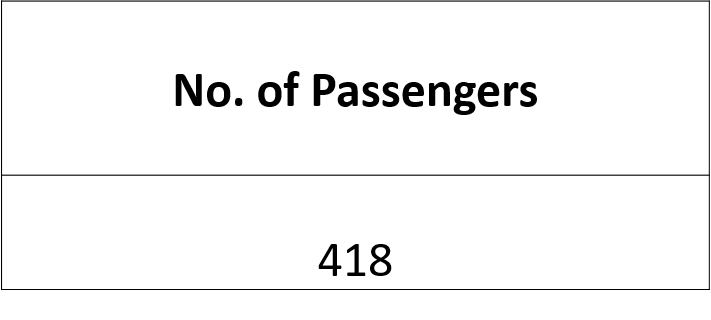
From the given data they were 418 passengers onboard the Titanic ship.

### 2.2 Passengers by Class
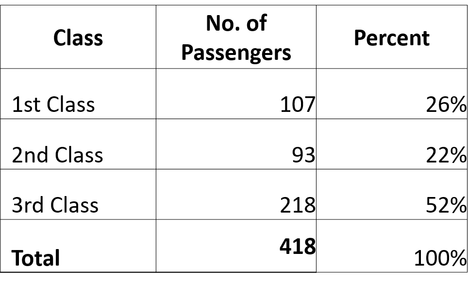
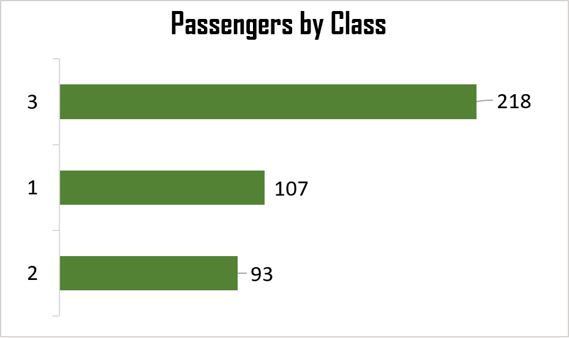
The data shows that 218 (~52%) passengers boarded the ship with 3rd class ticket, 107          (~26%) passengers boarded with 1st class ticket, while 93(~22%) passengers boarded with 2nd class ticket.

### 2.3 Passengers by Sex
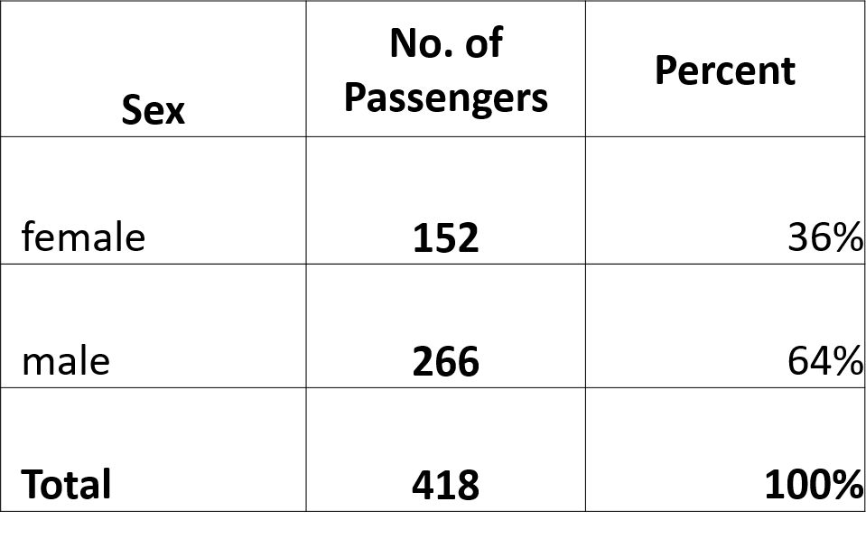
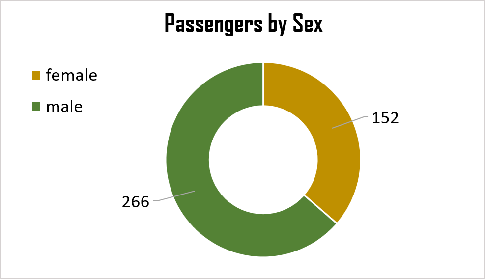
In the dataset, 266 passenger were male and 152 female that is; ~64% and 36% respectively. In other worlds, they were more male passengers than female.

### 2.4 Passengers by Age Group
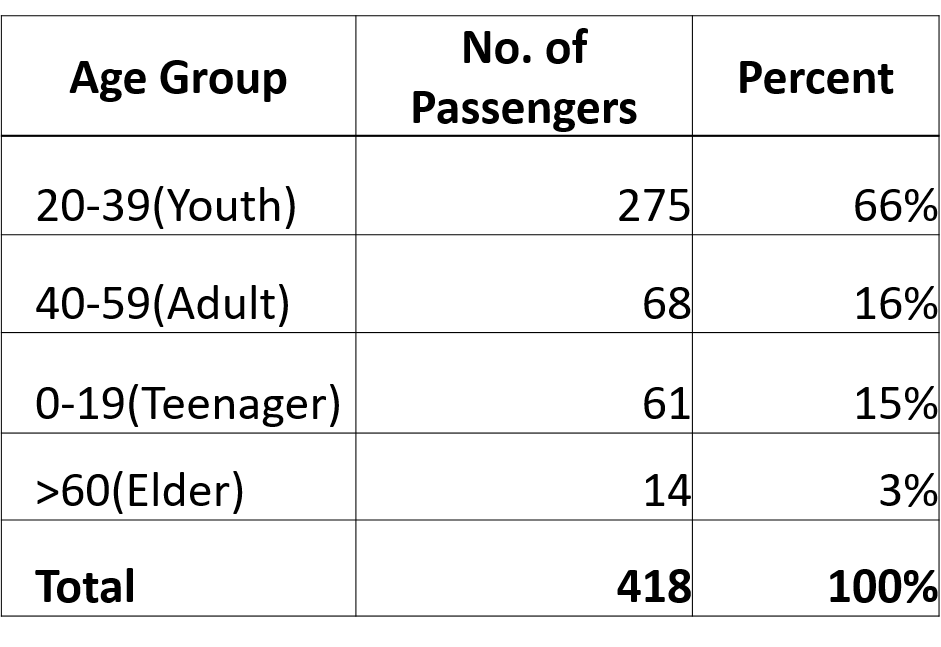
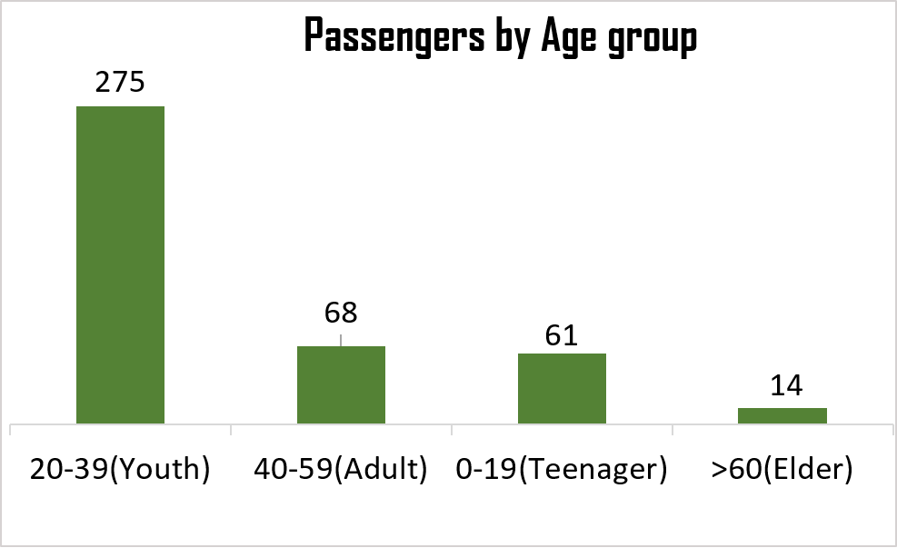
From the given data, I observed 332 registered ages and 86 missing. In order to capture all the registered ages, I manipulated the data using measure of Centre by filling the missing ages with the average age. From my analysis, they were more passengers between the ages of 20 – 39 years (~66%) and  lesser passengers that is; 14 (~3%) passengers are >60 years old.
	
### 2.5 Passengers by Siblings
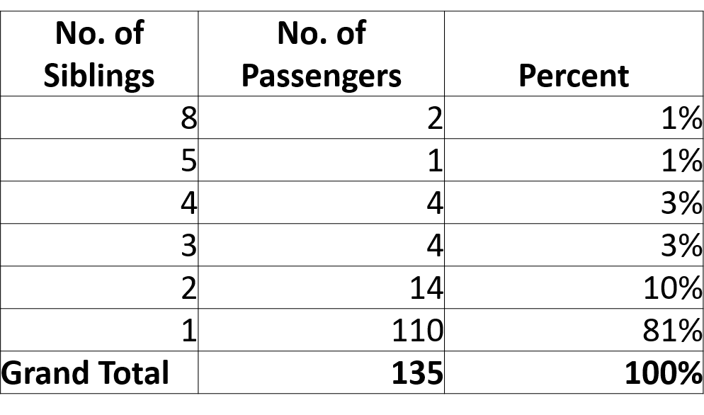

From my analysis on the data dataset, they were 135 passengers whose siblings aboard the ship; of all the passengers who had siblings aboard the ship, ~81% (110) of them had one(1) siblings aboard the ship.

### 2.6 Passengers by Children
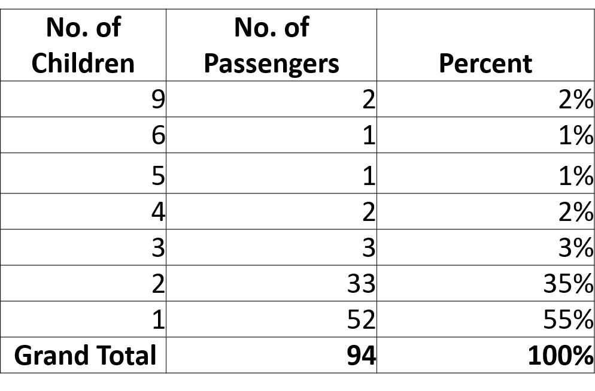

The analysis on the dataset shows total of 94 passengers whose children aboard the ship. Of all the passengers who had children aboard the ship, ~55% (52) of the them had a child aboard the ship.	  

### 2.7 Fare Prices
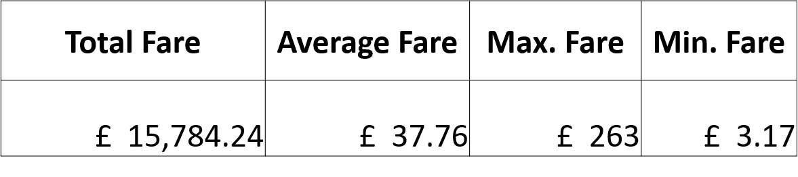
The total fare prices was £15,784.24, the average fare prices was £37.76, the maximum fare prices was £263 and the minimum fare prices was £3.17 respectively.

### 2.8 Passengers by Embarked Location
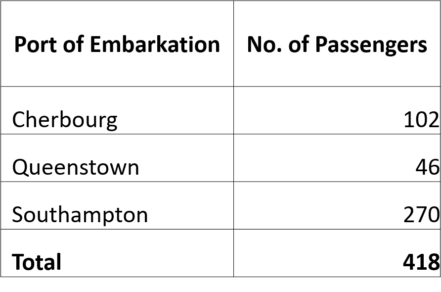

Passengers embarked on the ship from three (3) locations namely; Cherbourg, Queenstown and Southampton. 270 passengers went aboard the ship at port Southampton, 102 at port Queenstown and 46 at port Cherbourg. Southampton had the most passengers while Queenstown had the least passengers.

### 2.9 Passengers by Sex and Class
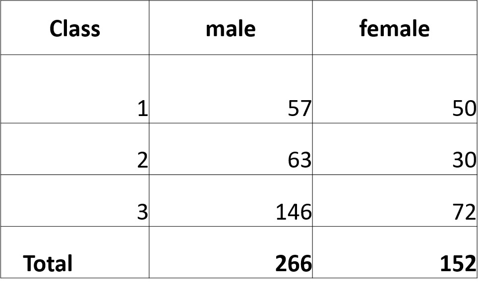

From my analysis, they were 57 males and 50 females who used the 1st class ticket, 63 males and 30 females who used the 2nd class ticket and finally, 146 males and 72 females used the 3rd class ticket.

### Figure 1 Overview dashboard

## 3 TAILORED DATA ANALYSIS

The next stage is tailored data analysis. The analysis in this study aims to make comparative analysis of passengers between each feature to determine the feature which would influence the survival rate as well as the dead rate. 

### 3.1 No. of Dead and Survived Passengers
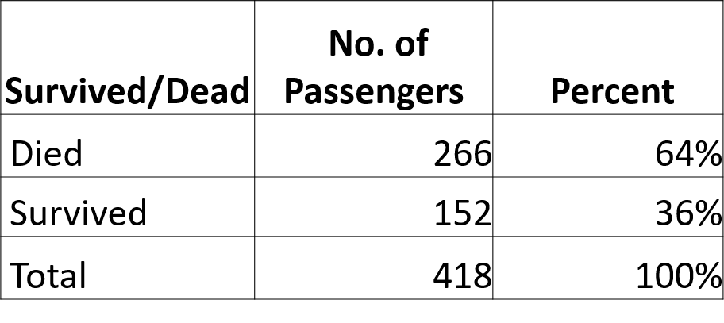
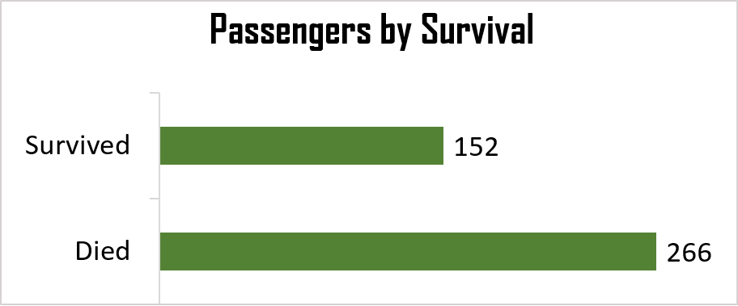
Based on the dataset, 266 passengers who aboard the ship died while 152 survived that is; 64% and 36% respectively.

### 3.2 Dead Passengers by Sex

From the dataset, all the 266 males aboard the ship died while none of the female passenger died.

### 3.2.1 Survived Passengers by Sex

From the dataset, all the 152 females aboard the ship survived while none of the male passengers survived.

### 3.3 Survived Passengers by Class

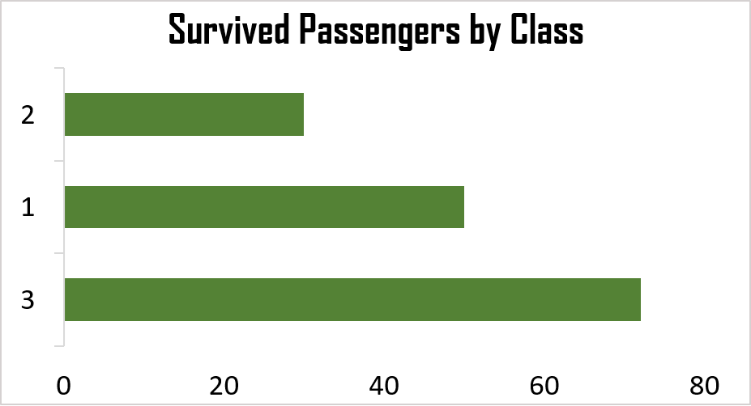
152 passengers from all 3 classes survived from the sank ship; of which 72(47%) of the survived passengers were 3rd class, 50(33%) passengers were 1st class and finally, 30(20%) passengers were of 2nd class.

### 3.4 Survived Passengers by Age Group
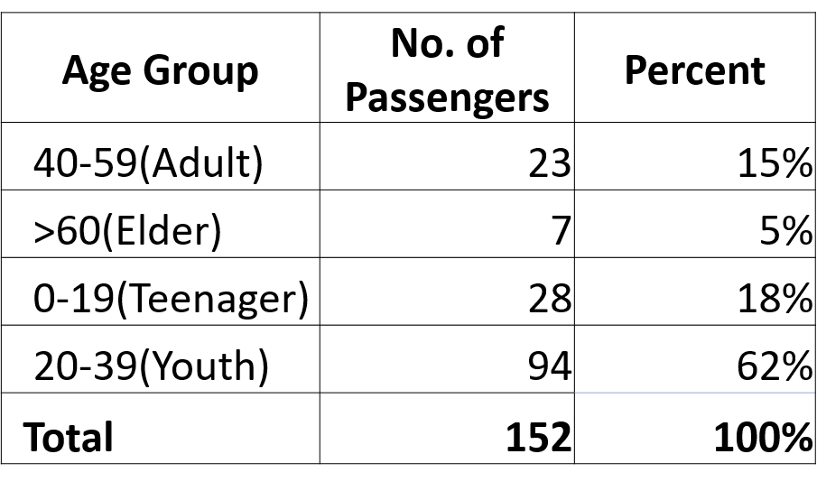
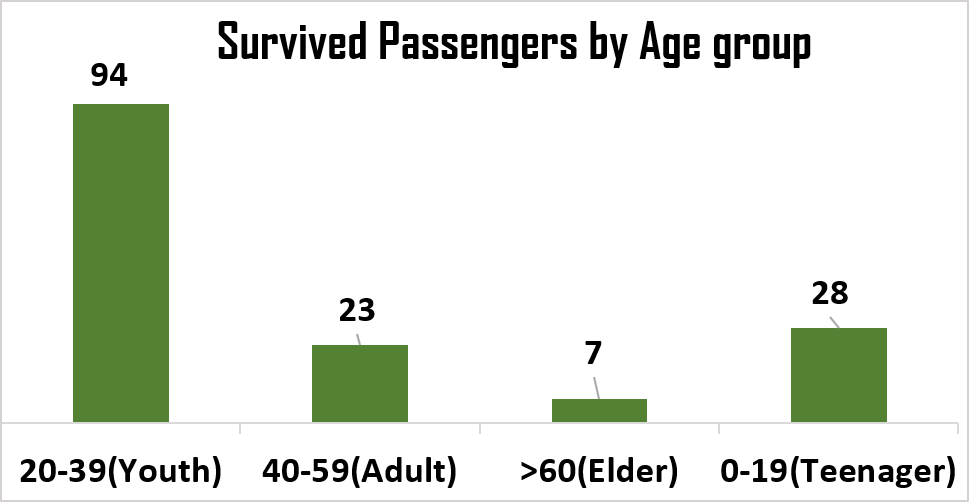
The analysis of survived passengers by age group shows that 94 passengers within the youth (20-39years) age bracket survived from the sank ship, 28  passengers within the teenager age (1-19years), 23 passengers within the adult age (40-59years) and finally, 7 passengers were elders (>60) also survived.

### 3.5 Survived Passengers by Embarked Location
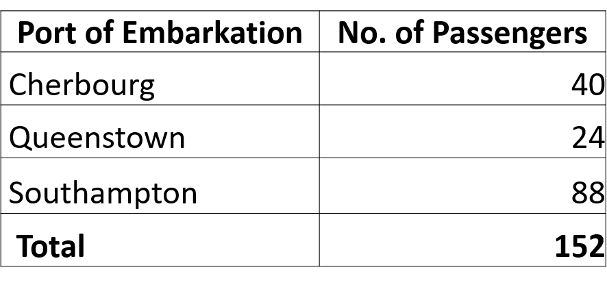
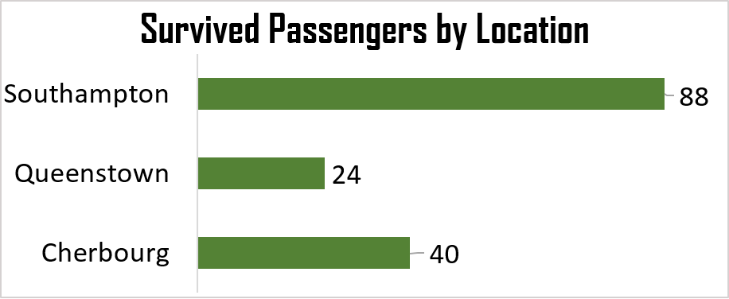
Some numbers 0f passengers who aboard the ship at different port of embarkation survived from the wrecked ship. 88 passengers survived at Southampton, 40 survived at Cherbourg, while 24 passengers survived at Queenstown respectively.

### 3.6 Survived Male to Female Ratio by Class
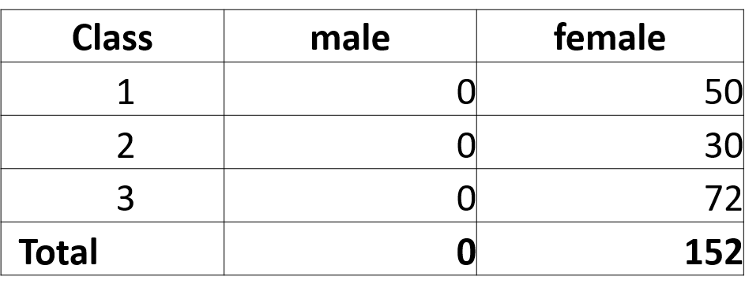
The ratio of male to female that survived the wrecked based on passenger’s class were; 0:50, 0:30 and 0:72 that is; 1st class, 2nd class and 3rd class respectively. Which entails no male survived the wrecked ship but all the females survived from the given dataset.

### 3.7 Survived Male to Female Ratio by Age Group
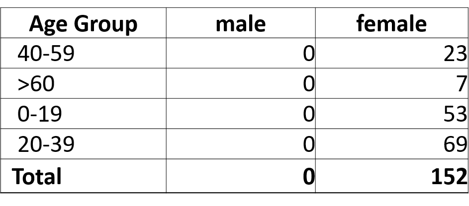
The ratio of male to female that survived the wrecked based on passenger’s age group were; 0:23, 0:7, 0:53 and 0:69 that is; 40-59 years, >60years, 0-19 years and 20-39 years respectively. Meaning no male survived the wrecked ship but all the females survived from the given dataset.

### Figure 2 Survived Passengers Dashboard

### Figure 3 Dead Passengers Dashboard

## 4 CONCLUSION
Data cleaning is the first step while performing data analysis. Exploratory data analytics in this context helps one to understand the dataset by showing the number of passengers in each features. EDA is used to figure out the total number of passengers that boarded the titanic ship based on class, sex, port of embarkation, passengers whose siblings aboard the ship and passengers whose children aboard the ship. Tailored data analytics in this study helps to give a simple comparison of passengers in each of the features in other to make predictions of how certain features could influence the survival rate and dead rate of the passengers. This is done by using graphical techniques.

By applying TDA some conclusions are drawn and facts are found. There is high influence of sex on survival. We can see from table-3.2 that the number of dead passengers are the total number of male (266), while in table-3.2.1, it can be seen that the number of survived passengers are the total number of female(152). With the high influence rate, we can say the female passengers are more likely to survive giving the 100 percent survival rate.

The influence of age on survival. The table below shows how age could influence the possibility of survival. Out of the total 418 passengers that aboard the ship, 152 (~36) passengers survived the wrecked ship; out of the 14 passengers within the elders ( >60 years) ages that boarded the ship, 7 survived; out of the 61 passengers within the teenager (0-19years) age bracket, 28 survived; out of the 68 passengers within the adult (40-59years) age bracket, 23 survived; and lastly, out of the 275 passengers within the youth (20-39years) age bracket, 94 passengers survived the wrecked ship.

With the above table we can say the passengers >60 years old with 50% survival rate is more likely to survive, followed by passengers between ages of 0-19years with survival rate of ~46%, while ages between 20-39years and 40-59years with the  survival rate of ~34% respectively, had less chance of survival.

